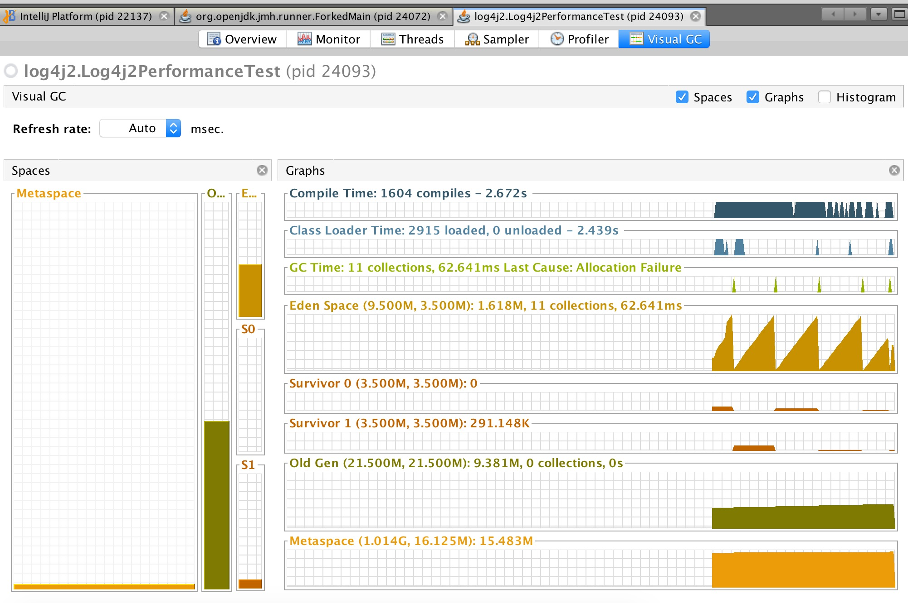
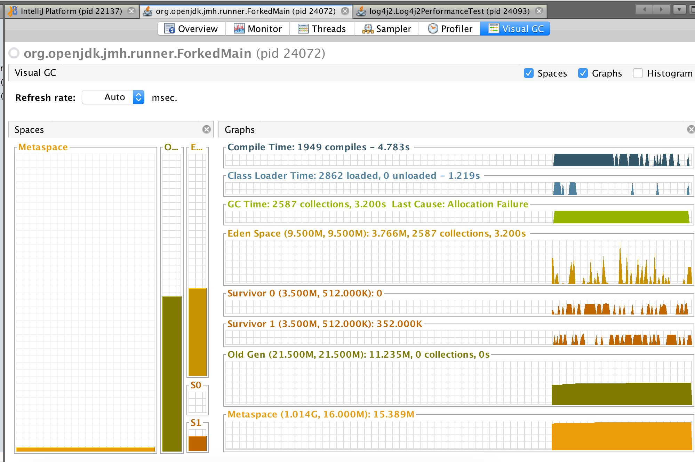

# log4j2性能测试


### 背景
本意是与logback的性能做下对比，于是顺带把log4j2的特性测了一遍
本次测试基于jmh做的
测试环境：
-   OS mac OS 10.13
-   JDK 1.8.0_181
-   CPU: 2.7 GHz Intel Core i5
-   memory: 8G
-   Log4j version:2.13.0
-   disruptor version: 3.4.2

### 关键字
`benchmark`、`disruptor`、`garbage free`

### 测试相关参数

运行需要加入vm参数：-DLog4jContextSelector=org.apache.logging.log4j.core.async.AsyncLoggerContextSelector 
-Dlog4j2.enable.threadlocals=true 
-Dlog4j2.enable.direct.encoders=true 
-Xms32m -Xmx32m


### logback VS log4j2 性能测试结果
TODO 待更新
测试前均会完成5次，每次10秒的warmup
启动jvm配置为1G内存


#### 吞吐量测试

```java
@Param({"shortLogInfo", "LongLogInfoLongLogInfoLongLogInfoLongLogInfoLongLogInfoLongLogInfoLongLogInfo"})
private String logOutputStr;
public void testThroughput() {
        LOGGER.info(logOutputStr + i++);
}
```


#####log4j配置
```xml
<Appenders>
    <RandomAccessFile name="RandomAccessFile" fileName="async-log4j2.log" immediateFlush="false" append="false">
        <PatternLayout>
            <Pattern>%d %p %c{1.} [%t] %m%n</Pattern>
        </PatternLayout>
    </RandomAccessFile>
</Appenders>
<Loggers>
    <Root level="info" includeLocation="false">
        <AppenderRef ref="RandomAccessFile"/>
    </Root>
</Loggers>
```


每次测试日志均是清空状态


### garbagefree
先看看官方怎么介绍的garbage free的，开启后可减少gc回收，提高系统的吞吐

### garbagefree 性能测试

通过visualVM查看，安装的visual-gc插件进行查看
测试方式：单线程不断打印日志，执行1分30秒左右，查看差距（测试吞吐的方式）
如图，2587次的gc和11次的gc(minor)比较，差距达到百倍

-   11 collections,consume 62ms

-   2587 collections,consume 3.2s


### garbagefree如何实现的
    allocate temporary objects like log event objects, Strings, char arrays, 
    byte arrays and more during steady state logging. 
    This contributes to pressure on the garbage collector and increases the frequency with which GC pauses occur.
官方原话，在输出日志过程中需要创建大量的临时对象，如log event，String，char arrays等
了解jvm的同学都知道，创建对象意味着在堆创建，堆内存通过gc回收；
于是log4j2的实现则将这些对象的属性保存到了ThreadLocal的一个map中，这样保证当方法栈执行完毕后，直接可随着栈回收

### 结论
-   打印的日志越大吞吐量越低
-   性能和线程的关系TODO 待测试
-   开启garbage free 可减少大量的gc回收，建议开启
-   性能方面log4j2 > logback > log4j1
-   输出日志parttern不配置类方法等信息，将会大幅提高吞吐（不再需要获取栈信息可提高性能）


### 相关文档地址
*   [JMH](http://openjdk.java.net/projects/code-tools/jmh/)
*   [garbagefree](http://logging.apache.org/log4j/2.x/manual/garbagefree.html)
*   [log4j2 async logger](http://logging.apache.org/log4j/2.x/manual/async.html)
*   [disruptor](https://github.com/LMAX-Exchange/disruptor/wiki/Introduction)
*   [JMH-visual-chart](https://github.com/Sayi/jmh-visual-chart) 