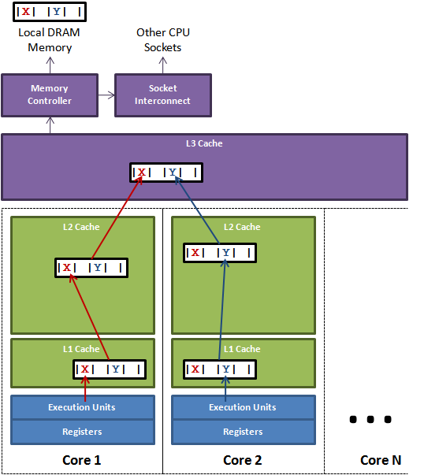

# 聊聊日志组件

#### 背景
你是否对平常工作中无时不刻不在用的日志组件了解么，你是否也有下面的问题；
如果有，就跟随着文章一起探究下它们其中的秘密吧

-   java的日志之间的关系是怎样的
-   日志的输出是同步还是异步的，是如何实现异步的
-   logback和log4j谁的性能更好
-   影响日志性能的因素有哪些

#### 日志的前世今生（sl4j、log4j,logback的关系）
sl4j与其他日志组件的关系就好像jdbc和各个驱动厂商的关系，sl4j定义了一套接口由不同的日志厂商实现

#### sl4j如何定义标准的
从平时的代码说起``LoggerFactory.getLogger``,让我们来看看getLogger做了什么
注：其中Logger和LoggerFactory都是slf4定义的接口和工厂


``` java
 public final class LoggerFactory {
    public static Logger getLogger(String name) {
        ILoggerFactory iLoggerFactory = getILoggerFactory();
        return iLoggerFactory.getLogger(name);
    }

    public static ILoggerFactory getILoggerFactory() {
        if (INITIALIZATION_STATE == UNINITIALIZED) {
            synchronized (LoggerFactory.class) {
                if (INITIALIZATION_STATE == UNINITIALIZED) {
                    INITIALIZATION_STATE = ONGOING_INITIALIZATION;
                    performInitialization();
                }
            }
        }
        switch (INITIALIZATION_STATE) {
        case SUCCESSFUL_INITIALIZATION:
            //获取日志工厂
            return StaticLoggerBinder.getSingleton().getLoggerFactory();
        case NOP_FALLBACK_INITIALIZATION:
            return NOP_FALLBACK_FACTORY;
        ...省略部分代码
        }
    }
    }
```

下图的bind方法就是扫描


那么问题来了，sl4j是如何找到的最终日志实现类呢，可以看到下图，没引入任何日志包时是这样的，


接着我们看下日志实现厂商logback的org.sl4j.impl下有一个这样的实现类，通过加载到实现类最终完成


当然，当你引入多个日志实现时sl4j会扫描到报错，这也是使用日志过程中常见的错，可能有别的依赖包引入了其他的日志实现，需要手动的排除


#### Logback的执行过程
`filter(过滤)`->`appender(输出)`->`encoder(转换)`->`layout(格式)`


让我们先来看看Logback中的Logger.info中最终调用的方法
``` java
private void filterAndLog_0_Or3Plus(final String localFQCN, final Marker marker, final Level level, final String msg, final Object[] params,
                final Throwable t) {
    //第一步：先执行过滤器
    final FilterReply decision = loggerContext.getTurboFilterChainDecision_0_3OrMore(marker, this, level, msg, params, t);


    if (decision == FilterReply.NEUTRAL) {
        if (effectiveLevelInt > level.levelInt) {
            return;
        }
    } else if (decision == FilterReply.DENY) {
        return;
    }
    //第二步：执行appender
    buildLoggingEventAndAppend(localFQCN, marker, level, msg, params, t);
}

```

#### 组件（appender，filter，layout）及介绍作用

Logger依赖了filter及appender； appender依赖于layout

##### filter
TODO 默认开启哪些过滤器
主要做过滤器，官方提供了如下几个过滤器


-   DuplicateMessageFilter   用于检测重复的消息 维护了一个100长度的lru缓存，缓存打印的日志及次数，超过5次则丢弃
-   DynamicThresholdFilter   动态控制日志的级别
-   MarkerFilter 用于验证日志请求中包含指定标识
-   ReconfigureOnChangeFilter 配置修改重配置过滤器
-   TurboFilter  所有过滤器的基类


##### appender
appender用于日志的输出组件

-   DBAppender 将日志信息输出到DB
-   ConsoleAppender 输出到控制台
-   FileAppender  输出到文件
-   AsyncAppender  异步日志
-   RollingFileAppender 日志自动切分


##### layout

layout 负责将event转换程最终要输出的日志格式
通过一个convert处理链，循环的执行替换其中关心的替换符
比如：DateConverter、ThreadConverter、MessageConverter等


##### logback是如何实现异步输出日志的 
logback的实现采用了生产者消费者模型，appender负责将事件发送到缓冲（队列，在Loback中采用ArrayBlockingQueue）
由一个线程（消费者）从缓冲中取出将最终将日志写入文件中

让我们先看下async appender的一个配置，配置了缓冲区的队列大小512
``` xml
 <appender name="ASYNC" class="ch.qos.logback.classic.AsyncAppender">

        <discardingThreshold>0</discardingThreshold>
        <includeCallerData>false</includeCallerData>
        <queueSize>512</queueSize>
        //配置异步输入日志的实现
        <appender-ref ref="APP_INFO" />
</appender>
``` 

``` java
public class AsyncAppenderBase<E> extends UnsynchronizedAppenderBase<E> implements AppenderAttachable<E> {

    public static final int DEFAULT_QUEUE_SIZE = 256;
    int queueSize = DEFAULT_QUEUE_SIZE;
    
    @Override
    public void start() {
        // ....省略掉部分代码
        // 1.定义了一个缓冲区
        blockingQueue = new ArrayBlockingQueue<E>(queueSize);

        if (discardingThreshold == UNDEFINED)
            discardingThreshold = queueSize / 5;
        addInfo("Setting discardingThreshold to " + discardingThreshold);
        worker.setDaemon(true);
        worker.setName("AsyncAppender-Worker-" + getName());
        // make sure this instance is marked as "started" before staring the worker Thread
        super.start();
        
        //启动后初始化消费者
        worker.start();
    }

    @Override
    protected void append(E eventObject) {
        if (isQueueBelowDiscardingThreshold() && isDiscardable(eventObject)) {
            return;
        }
        preprocess(eventObject);
        put(eventObject);
    }
    
    //2. 将日志放入队列
    private void put(E eventObject) {
        if (neverBlock) {
            blockingQueue.offer(eventObject);
        } else {
            putUninterruptibly(eventObject);
        }
    }
    
    //3. 定义了一个线程用于做消费者，消费队列中的日志
    class Worker extends Thread {
    
        public void run() {
            AsyncAppenderBase<E> parent = AsyncAppenderBase.this;
            AppenderAttachableImpl<E> aai = parent.aai;

            // loop while the parent is started
            while (parent.isStarted()) {
                try {
                    //4. 不断的循环从队列中拿出进行处理
                    E e = parent.blockingQueue.take();
                    aai.appendLoopOnAppenders(e);
                } catch (InterruptedException ie) {
                    break;
                }
            }

            for (E e : parent.blockingQueue) {
                aai.appendLoopOnAppenders(e);
                parent.blockingQueue.remove(e);
            }

            aai.detachAndStopAllAppenders();
        }
    }
}
``` 

##### 如果队列满了怎么办

看如下源码，默认配置为如果队列中容量只剩20%则会丢弃；
也可以配置为永不丢弃日志或根据日志级别丢弃日志（降级）
``` java
//默认的策略是队列中容量还剩20%则会进行丢弃
if (discardingThreshold == UNDEFINED)
            discardingThreshold = queueSize / 5;

//判断是否超过            
private boolean isQueueBelowDiscardingThreshold() {
        return (blockingQueue.remainingCapacity() < discardingThreshold);
}

//什么级别的日志可丢弃，在实现中是TRACE, DEBUG , INFO
protected boolean isDiscardable(ILoggingEvent event) {
        Level level = event.getLevel();
        return level.toInt() <= Level.INFO_INT;
    }
    
protected void append(E eventObject) {
    if (isQueueBelowDiscardingThreshold() && isDiscardable(eventObject)) {
        return;
    }
    preprocess(eventObject);
    put(eventObject);
}
```


##### logback是每次都一行行写入文件吗
从如下源码可以看出，logback的默认缓冲区大小为8kb，根据日志的配置immediateFlush(默认为true)决定将
日志刷到文件上的频率，显然调整immediateFlush可以降低服务器上磁盘io，并提高日志的吞吐

``` java
  //默认的缓存区大小为8kb
 public static final long DEFAULT_BUFFER_SIZE = 8192;

 
 public ResilientFileOutputStream(File file, boolean append, long bufferSize) throws FileNotFoundException {
         this.file = file;
         fos = new FileOutputStream(file, append);
          //可以看到最终依赖的是BufferedOutputStream的方式写入
         this.os = new BufferedOutputStream(fos, (int) bufferSize);
         this.presumedClean = true;
     }

 private void writeBytes(byte[] byteArray) throws IOException {
        if(byteArray == null || byteArray.length == 0)
            return;
        
        lock.lock();
        try {
            this.outputStream.write(byteArray);
            //如果immediateFlush为true则不等缓存区满也刷到磁盘上
            if (immediateFlush) {
                this.outputStream.flush();
            }
        } finally {
            lock.unlock();
        }
```


从阅读源码的过程中，还看到了一个配置项`includeCallerData`,那么这个参数是干什么的呢？
见源码分析可以看出，如果在日志中需要打印日志的行号、方法名等需要将这个属性开启，默认是关闭的状态
由于该参数会降低性能（显而易见，需要动态获取行号等需要消耗性能）
``` java
protected void preprocess(ILoggingEvent eventObject) {
        eventObject.prepareForDeferredProcessing();
        //如果开启，则调用getCallerData
        if (includeCallerData)
            eventObject.getCallerData();
    }
    
public interface ILoggingEvent {
    //接口返回的StackTraceElement的一个数组
    StackTraceElement[] getCallerData();
}

//从类的属性中可以看到，原来是保存 类名、方法名、执行行号的
public final class StackTraceElement implements java.io.Serializable {
    private String declaringClass;
    private String methodName;
    private String fileName;
    private int    lineNumber;
}  
         
```    

#### 其他优化方式
可设置neverBlock为false，则调用队列的offer，但会有丢日志的风险
``` java
private void put(E eventObject) {
        if (neverBlock) {
            //风险：会有丢日志的风险，但能提高点性能
            blockingQueue.offer(eventObject);
        } else {
            putUninterruptibly(eventObject);
        }
    }
```

#### 其他特性（配置文件自动更新）
使用场景：动态调整日志级别，可以在运行期替换掉相应的日志文件，如果开启则会定时进行扫描
-   配置方式
``` xml
<configuration scan="true" scanPeriod="60000">
</configuration>
```
-   如何实现
ReconfigureOnChangeTask
简单说就是启一个定时器线程，根据配置间隔时间进行检测，检测配置文件的修改时间

``` java
void processScanAttrib(InterpretationContext ic, Attributes attributes) {
 ReconfigureOnChangeTask rocTask = new ReconfigureOnChangeTask();
 //开启一个定时任务，定时执行
 ScheduledFuture<?> scheduledFuture = scheduledExecutorService.scheduleAtFixedRate(rocTask, duration.getMilliseconds(), duration.getMilliseconds(),
                            TimeUnit.MILLISECONDS);
}

public class ReconfigureOnChangeTask implements Runnable {

     @Override
     public void run() {
         fireEnteredRunMethod();
         
         ConfigurationWatchList configurationWatchList = ConfigurationWatchListUtil.getConfigurationWatchList(context);
        
         //省略部分代码....
         if (mainConfigurationURL.toString().endsWith("xml")) {
             performXMLConfiguration(lc, mainConfigurationURL);
         }
     }
}
```  

#### logback VS log4j2
首先log4j和loback的实现思路基本一致（同一个作者），但在缓冲区以及部分实现上有差异
先给出结论，性能上log4j2的性能超过logback；

| 日志实现       | 队列实现   |
| ----:   | ----------:    | 
|  logback       | ArrayBlockingQueue  | 
|  log4j2       | RingBuffer	  |


#### 为什么日志组件都选择了有界队列
当出现生产消费(可能磁盘损坏等)速度跟不上的时候，通过有界队列的限流达到不影响业务；
作为日志组件来说，相对于业务，日志应该是可以可降级的功能

另外一个原因，ConcurrentLinkedQueue作为jdk实现的并发的无界队列，每次放入元素，
都需要new一个Node，显然当出队时jvm需要回收相关对象（具体可参考之前wangshu的垃圾回收次数）

#### 为什么Lo4j2性能更好
-   缓冲区实现更优(ArrayBlocking(有锁定长队列) vs Disruptor(无锁定长环))
-   写入文件实现(FileOutputStream vs RandomAccessFile) 官方说性能提升20%-200% 
-   可开启garbage free模式，减少因大量的日志输出导致频繁的gc（根据个人测试结果是3000次gc降低至10次）


#### 从日志组件的角度看系统设计
个人思考，可以从日志组件看系统设计，这些点也是平常系统设计中会关注的点；
比如接口的限流；服务的降级策略；同步异步的性能优化等

-   限流（利用定长队列做到）
-   降级（当队列超过阈值时根据指定策略，可按照级别丢弃）
-   性能优化（同步变异步，利用缓冲区写入日志减少磁盘io）


#### 聊聊CPU
离cpu越远，容量越大，速度也越慢，价格也更便宜
寄存器->L0->L1->L2->L3->ROM(内存)->RAM(磁盘)

| 从CPU到        | 大约需要的 CPU 周期    |大约需要的 CPU 周期    | 
| ----:   | ----------:   |  ----------:   | 
| 寄存器        | 1 cycle	  |  |
| L1        | 约3-4 cycles	  | 约1ns |
| L2        | 约10 cycles	  | 约3ns |
| L3        | 约40-50 cycles	  | 约15ns  |
| 内存        |   | 60-80ns |


当CPU执行运算的时候，它先去L1查找所需的数据，再去L2，然后是L3，最后如果这些缓存中都没有，所需的数据就要去主内存拿。走得越远，运算耗费的时间就越长。所以如果你在做一些很频繁的事，你要确保数据在L1缓存中。

-   每核心都有一个自己的L1缓存。L1缓存分两种：L1指令缓存(L1-icache)和L1数据缓存(L1-dcache)。L1指令缓存用来存放已解码指令，L1数据缓存用来放访问非常频繁的数据。
-   L2缓存用来存放近期使用过的内存数据。更严格地说，存放的是很可能将来会被CPU使用的数据。
-   多数多核CPU的各核都各自拥有一个L2缓存，但也有多核共享L2缓存的设计。无论如何，L1是各核私有的(但对某核内的多线程是共享的)。


#### 缓存行填充
CPU为了提高读取数据的速度，会将数据缓存，在这边存储的单位为缓存行，
一个缓存行为64个字节(并不是所有，但大多数的CPU是)
一个Java的long类型是8字节，因此在一个缓存行中可以存8个long类型的变量。

``` java
//看看Ringbuffer的类实现，这是jdk7的优化方式
abstract class RingBufferPad
{
    protected long p1, p2, p3, p4, p5, p6, p7;
}

//jdk8提供了一个注解@Contended，可在类或者属性上进行注释，将会在头尾填充128个字节

```

#### 为什么要缓存行填充？

如下图所示，L1和L2都是每个核心独立的，但由于x和y在同一个缓存行上，
当core1修改了x，导致整个缓存行失效，则core2读取y需要到内存中重新读取新的值
这就是一个典型的伪共享



#### 内存屏障&缓存一致性协议
volatile的定义
我们都知道volatile修饰的变量
1   在每次修改后会保证其他线程读到的是当前的最新的值
2   禁止编译器进行指令重排序

当然volatile的修饰，锁和sychronize也可以达到一样的效果；
那么volatile修饰的变量在编译后是怎样的呢

|         |     | 
| ----:   | ----------:   | 
| Java代码        | instance = new Singleton();//instance是volatile变量     |
| 汇编代码        | 0x01a3de1d: movb $0x0,0x1104800(%esi);0x01a3de24: **lock** addl $0x0,(%esp);      |


有volatile变量修饰的共享变量进行写操作的时候会多第二行汇编代码，通过查IA-32架构软件开发者手册可知，lock前缀的指令在多核处理器下会引发了两件事情。

-   将当前处理器缓存行的数据会写回到系统内存
-   这个写回内存的操作会引起在其他CPU里缓存了该内存地址的数据无效。

#### 参考资料
*   [logback](http://logback.qos.ch/manual/architecture.html)
*   [log4j-sync](http://logging.apache.org/log4j/2.x/manual/async.html)
*   [disruptor](https://github.com/LMAX-Exchange/disruptor/wiki/Introduction)
*   [disruptor-cacheline-padding](http://ifeve.com/disruptor-cacheline-padding/) 
*   [volatile](http://ifeve.com/volatile/) 
*   [disruptor-memory-barrier](http://ifeve.com/disruptor-memory-barrier/) 
*   [locks-are-bad](http://ifeve.com/locks-are-bad/) 
